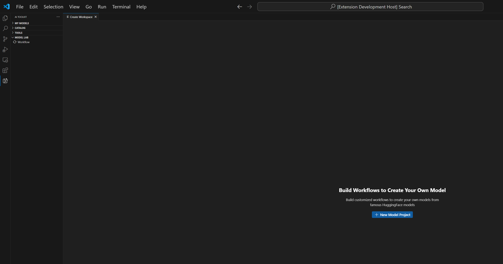
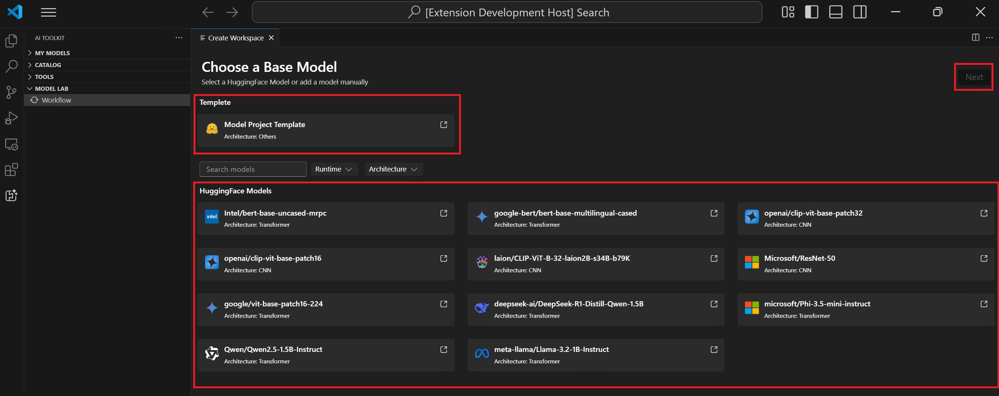
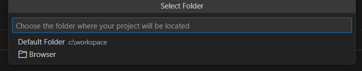
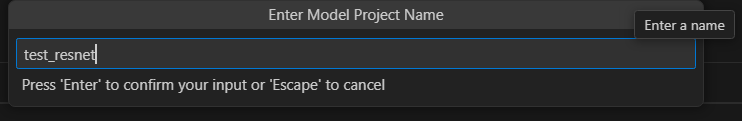
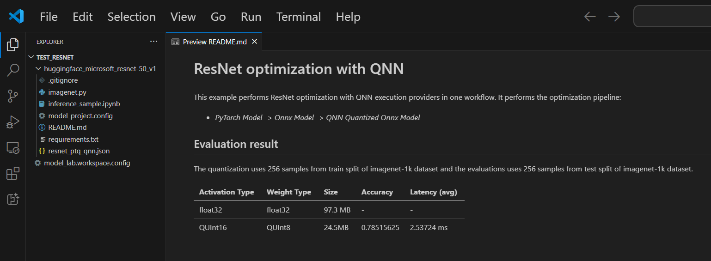

# Create Model Lab Project

## Create Project
1. Select `MODEL LAB` blade on the left panel. Click `Workflow`. Click `New Model Project`.

2. A page contains model list will be opened. When first time you create a model project, it need about 20 minutes to setup environment. Select a base model you want to operate on. Click `Next`.

3. On top of the window, there will be a series of dropdown for providing model project location and name.

    Select or create a folder as model project folder.
    
    Enter model project name. Press `Enter`.
    

4. A folder contains model files will be created and opened. You can refer the readme to get the infomation of this model.

## Open Project
Open model project folder through Vscode. Click File -> Open Folder, select model project folder. You need to close folder first if you already open one.

## Add Model
1. Open a model project. Click `Workflow`. On right top of the page, Click `Add models`. 

2. Select a base model you want to operate on. Click `Add`.
3. A folder contains new model files will be created on current project folder.

## Create A New Project
Click `Workflow`. On right top of the page, Click `New Project`.

Alternatively, you can close model project and [create project](#create-project) from beginning.
