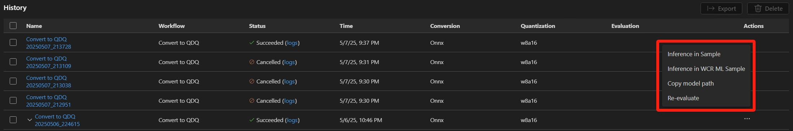

# History section

The "History" section provides a detailed record of tasks performed using model lab. This section is divided into several columns, each representing different aspects of the tasks.

## Name

The name of the task.

## Workflow

This column displays the name of workflow executed.

## Status

This column shows the current status of the task. You can click the log link to view the whole log.

Common statuses include:

- **Succeeded:** The task was completed successfully.
- **Cancelled:** The task was cancelled before completion.
- **Failed:** The task was failed.

## Time

This column records the date and time when the task started executing.

## Conversion

This column indicates if there is any conversion in the task and what is the conversion format.

## Quantization

This column specifies details about quantization used in the task. An example entry is "w8a16," which indicates weight type is 8 bit and activation type is 16 bit.

## Evaluation

This column provides evaluation metrics such as accuracy and latency. You can click the link to view the whole metrics.

## Actions

This column offers several options to manage your tasks. You can perform the following actions:

- **Inference in Sample:** Run inference using a sample code with the converted model.
- **Copy Model Path:** Copy the file path of the model for easy access and use in other applications.
- **Re-evaluate:** Re-run the evaluation process for the converted model.

## Selecting Histories

Click on the checkboxes next to the tasks you want to select. You can select multiple tasks at once.

## Export Histories

Once you have selected the tasks, click on the "Export" button. This will allow you to export the tasks so that other people can rerun them on their computers.

## Delete Histories

To delete selected tasks, click on the "Delete" button. This will remove the selected tasks from the history, helping you keep your records clean and organized.
