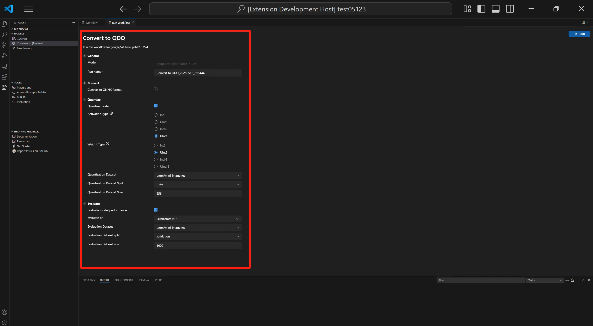

# What Is Model Conversion
Model conversion is an integrated development environment designed to help developers and AI engineers to convert, quantize, optimize and evaluate the pre-built machine learning models on your local windows platform. It provides a simplify , end-to-end experience for working with models from sources like Hugging Face, and prepares them for efficient inference on devices powered by NPUs, GPUs and CPUs.

# What Can You Do In Model Conversion
- Create model project easily

    Start by creating a new model project using a guided template. Choose from pre-configured recipes for supported models or begin with a blank template to fully customize workflows—ideal for Hugging Face PyTorch models.
- Run a workflow with default recipes

    Each project supports a customizable workflow that includes the everything needed for model conversion end-to-end.
- Model conversion (PyTorch to ONNX)
- Optimization and quantization (QDQ quantization for NPU acceleration with different execution providers (EPs))
- Evaluation metrics with public datasets
- Sample inference notebooks
- Exporting and sharing results
- Built-in runtime setup

    Model conversion automatically sets up a Python environment for model conversion workflow and inference, ensuring dependencies are handled per recipe.
- Track and sharing results with others

    Every run is versioned and stored in a history folder. You can re-evaluate, export or share these runs with others.

# Prerequisites
- Snapdragon powered Copilot+ PCs running Windows 11
- 32GB+ memory
- Install VS Code extension `AI Toolkit`. Please follow https://learn.microsoft.com/en-us/windows/ai/toolkit/toolkit-getting-started?tabs=rest#install

# Create Project
Creating a project in Model Conversion is the first step toward converting, optimizing, quantizing and evaluating machine learning models. This guide walks you through the process on how to create a model project.

## Launch Model Conversion
Select `MODEL LAB` blade on the primary sider bar. Click `Workflow`. Click `New Model Project`.

## Start a New Project
A page contains model list will be opened. When first time you create a model project, it need about 20 minutes to setup environment. Select a base model you want to operate on. Click `Next`.

##### Notice:
**Supported Models**: Model Conversion currently supports a growing list of models, including top Hugging Face models in PyTorch format.
#### LLM Models

| Model Name                             | Hugging Face Path                               |
|----------------------------------------|-------------------------------------------------|
| Qwen2.5 1.5B Instruct                  | `Qwen/Qwen2.5-1.5B-Instruct`                    |
| DeepSeek R1 Distill Qwen 1.5B          | `deepseek-ai/DeepSeek-R1-Distill-Qwen-1.5B`     |
| Meta LLaMA 3.2 1B Instruct             | `meta-llama/Llama-3.2-1B-Instruct`              |
| Phi-3.5 Mini Instruct                  | `Phi-3.5-mini-instruct`                         |

#### Non-LLM Models
| Model Name                             | Hugging Face Path                               |
|----------------------------------------|-------------------------------------------------|
| Intel BERT Base Uncased (MRPC)         | `Intel/bert-base-uncased-mrpc`                  |
| BERT Multilingual Cased                | `google-bert/bert-base-multilingual-cased`      |
| ViT Base Patch16-224                   | `google/vit-base-patch16-224`                   |
| ResNet-50                              | `resnet-50`                                     |
| CLIP ViT-B-32 (laion)                  | `laion/CLIP-ViT-B-32-laion2B-s34B-b79K`         |
| CLIP ViT Base Patch16                  | `clip-vit-base-patch16`                         |
| CLIP ViT Base Patch32                  | `clip-vit-base-patch32`                         |

## Choose a Template
`Predefined Recipes`: choose the base model from the supported model list such as Clip, ResNet or BERT.
Or `Blank Template` : Ideal for advanced users and model is not listed in base model, select from template for customizing the workflows.

## Enter Project Details
On top of the window, there will be a series of dropdown for providing model project location and name.

Select or create a folder as model project folder.

Enter model project name. Press `Enter`.

##### Notice:
**ReadMe Access**: A README file is included in each project. You can refer the readme to get the infomation of this model. If you close it, you can reopen it via the workspace.

# Run workflow
Running a workflow in Model Conversion is the core step that transform the pre-built ML model into an optimized and quantized onnx model. You can converting a Hugging Face PyTorch model with a pre-defined recipe. This tutorial walks you through the process on how to run a workflow.

## Open Your Model Project
After openning the panel, you could see that the parameters are categorized into several sections. Note that the sections could be different for different workflows.

## Review Workflow Configuration
Click the workflow template to view the conversion recipe. You can edit the configuration to customize steps like:
### Conversion
The workflow will always convert model to ONNX format, so it is enabled by default and could not be disabled.

##### Notice:
If you want to convert [LLM models](#llm-models), a Nvidia GPU is required. Then Model Lab will setup environment.
If you want to setup environment to utilize GPU by yourselves, please refer [ManualConversionOnGPU](Tutorials/ManualConversionOnGPU.md)
Please note that this doesn't means the model will be evaluated on GPU.

### Quantization
In this section, you could configure the parameters for quantization.
- **Activation Type**: this is the data type used to represent the intermediate outputs (activations) of each layer in the neural network.
- **Weight Type**: this is the data type used to represent the learned parameters (weights) of the model.
- **Quantization Dataset**: dataset used for quantization.
    ##### Notice:
    **Hugging Face Compliance**: If your selected model or dataset is hosted on Hugging Face, you may be prompted to accept license terms before proceeding. For imanenet-1k dataset, you need to input your HF token to proceed. (instruction for getting the token instruction from HF) This is required to ensure legal compliance.

- **Quantization Dataset Split**: dataset could have different splits like validation, train and test.
- **Quantization Dataset Size**: the number of data used to quantize the model.

For more information about activation and weight type, please see [Data type selection](https://onnxruntime.ai/docs/performance/model-optimizations/quantization.html#data-type-selection).

You could also disable this section. In this case, the workflow will only convert the model to ONNX format but do not quantize the model.
##### Notice:
Quantization is optimized of only NPU. It's recommaneded to uncheck this section if target system is not NPU.

### Evaluation
In this section, you need to select the Execution Provider (EP) you want to use for evaluation, regardless of the platform on which the model was converted. You can also configure additional evaluation parameters here.
- **Evaluate on**: the target device that you want to evaluate the model on. Possible values are:
  + **Qualcomm NPU**: to use this, you need a compatible Qualcomm device.
  + **CPU**: any CPU could work.
- **Evaluation Dataset**: dataset used for evaluation.
- **Evaluation Dataset Split**: dataset could have different splits like validation, train and test.
- **Evaluation Dataset Size**: the number of data used to evaluate the model.

You could also disable this section. In this case, the workflow will only convert the model to ONNX format but do not evaluate the model.

## Run the Workflow
After configuring all sections, you could click **Run** to start the conversion process.

A default job name will be generated using the workflow name and timestamp (e.g., `bert_qdq_2025-05-06_20-45-00`) for easy tracking.

## Cancel Workflow
Click `Cancel` on the poped status window.

## Track Progress
It takes long time when first time running workflows. In general, it may take 15~20 minutes for overall process, which including environment setup process.

The first run may take more than 20 minutes as Model Lab installs dependencies and sets up a Python environment. Next time it will be much faster.

A terminal view will display progress indicators to keep you informed.

## View Results
Once complete, results are stored in the **History** tab.
You can:
- View metrics and evaluation results
- Export the run folder
- Launch inference samples
- Re-evaluate with new datasets

##### Notice
- If your job is canceled or failed, you can click job name to view the configuration and run job again.
- To avoid accidental overwrites, each execution creates a new history folder with its own configuration and results.
- **Compliance Alerts**: If your workflow uses a gated dataset (e.g., from Hugging Face), you’ll be prompted to accept the license terms before proceeding. This is required for legal compliance. (instruction for token xxxx)
- **Workspace Portability**: All artifacts (e.g., Olive config, scripts, evaluation results) are saved in the run folder. You can export this folder to share with others or run it outside Model Lab.

# Manage History
The History Board in Model Lab is your central dashboard for tracking, reviewing, and managing all workflow runs. Each time you run a model conversion, optimization, or evaluation, a new entry is created in the History Board—ensuring full traceability and reproducibility.

## What You Can Do In The History Board
### Inspect Workflow Configuration
Click the run name to open the full configuration used for that job.
This includes the Olive config, model path, and execution provider (EP) details.

### View Workflow Status
Each run is listed with a status indicator (e.g., Succeeded, Cancelled).
You can click on the status to view logs and detailed execution results.

### Access Evaluation Metrics
Metrics such as accuracy, latency, and throughput are displayed alongside each run.
These are grouped with the status column for a cleaner, optimized layout.

### Export and Share
Use the three-dot menu under Actions to:
- Export the run folder
- Copy the model path
- Launch inference samples

Exported folders are portable and can be shared or reused outside Model Lab.

### Re-Evaluate Models
You can re-run evaluations using different datasets or metrics directly from the History Board.
This supports iterative tuning and validation.

After a model has been successfully converted, you could use the re-evaluate function to perform evaluation again without repeating the conversion process.

After opening the panel, you could see that the parameters are categorized into two sections.

#### General section
In this section, you could set the name for this re-evaluation.
By default, a name with `Re-eval` and model run name is set for you.

#### Evaluate section
In this section, you could configure the parameters for re-evaluation.

- **Evaluate on:** the target device that you want to evaluate the model on. Possible values are:
  + *Qualcomm NPU*: to use this, you need a compatible Qualcomm device.
  + *CPU*: any CPU could work.
- **Evaluation Dataset**: dataset used for evaluation.
- **Evaluation Dataset Split**: dataset could have different splits like validation, train and test.
- **Evaluation Dataset Size**: the number of data used to evaluate the model.

After configuring all sections, you could click `Run` to start the re-evaluation process.

### Inference Samples
After converting and optimizing your model in Model Lab, you can validate its performance and behavior using Inference Samples. This feature allows you to run sample inference directly within your local environment using the converted model and a pre-configured Python runtime.

### When to Use Inference Samples
Use inference samples to:
- Validate that your converted model runs correctly on your target hardware (e.g., NPU, GPU, CPU).
- Compare outputs across different execution providers (EPs).
- Demonstrate model behavior in a lightweight, reproducible way.
- Share a working sample with teammates or integrate into a Windows app project.

### How to Run Inference Samples
- After a successful workflow run, go to the History tab in your project. Click the three-dot menu next to the completed run. Select **“Inference in Samples”** from the dropdown.
- Choose the Python Environment
    You’ll be prompted to select a Python virtual environment.
The default path is: `C:\Users<your name>.aitk\bin\model_lab_runtime\Python-CPU-win32-x64-0.0.1`.

    This environment is automatically set up by Model Lab during the first run.

### Run the Sample
The sample will launch in a Jupyter Notebook or script, depending on the recipe.
You can modify the input data or parameters to test different scenarios.

##### Tips and Best Practices
- **Model Compatibility:** Ensure your model supports the selected EP (e.g., QNN for Qualcomm, STX for AMD, LNL for Intel).
- **Sample Location:** Inference samples are stored alongside the run artifacts in the history folder.
- **Custom Inputs:** You can edit the sample notebook to test with your own data.
- **Export and Share:** Use the export option in the History Board to share the full run folder, including the inference sample.

##### Known Limitations
- **LLM Models:** Running inference for large language models (LLMs) may require high-end GPUs or cloud-based conversion. Model Lab currently supports LLMs in a limited capacity with manual steps.
- **Runtime Setup Time:** The first-time setup of the Python environment may take up to 20 minutes. Progress indicators are shown in the terminal.
