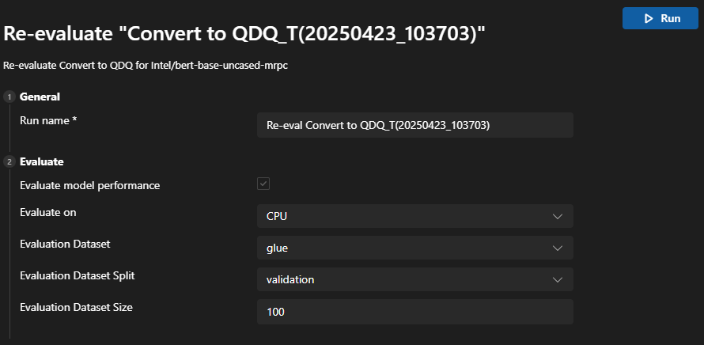

# How to re-evalute the model

After finishing converting the model, you could use the re-evaluate function to do evaluation on the model without running the conversion process again.

After openning the panel, you could see that the parameters are categorized into two sections.

## General section

In this section, you could set the name for this re-evaluation. By default, a name with Re-eval and model run name is set for you.

## Evaluate section

In this section, you could configure the parameters for re-evaluation.

- Evaluate on: the target device that you want to evaluate the model on. Possible values are:
    + Qualcomm NPU: to use this, you need a compatible Qualcomm device.
    + CPU: any CPU could work.
- Evaluation Dataset: dataset used for evaluation.
- Evaluation Dataset Split: dataset could have different splits like validation, train and test.
- Evaluation Dataset Size: the number of data used to evaluate the model.

After configuring all sections, you could click `Run` to start the re-evaluation process.
