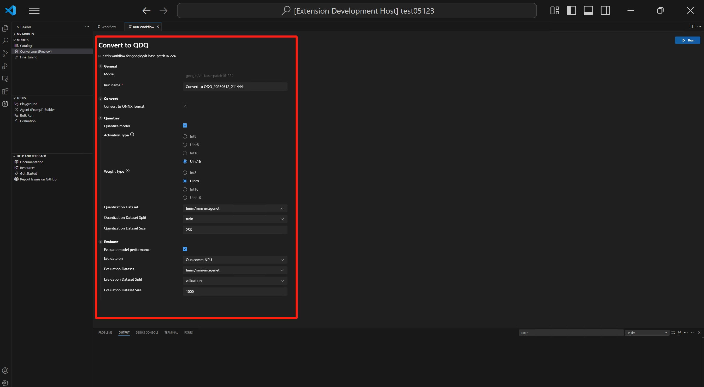

# How to run the workflow

After openning the panel, you could see that the parameters are categorized into several sections. Note that the sections could be different for different workflows.

## General section

In this section, you could set the name for this run. By default, a run name with workflow name and current time is set for you.

## Convert section

The workflow will always convert model to ONNX format, so it is enabled by default and could not be disabled.

## Quantize section

In this section, you could configure the parameters for quantization.

- Activation Type: this is the data type used to represent the intermediate outputs (activations) of each layer in the neural network.
- Weight Type: this is the data type used to represent the learned parameters (weights) of the model.
- Quantization Dataset: dataset used for quantization.
- Quantization Dataset Split: dataset could have different splits like validation, train and test.
- Quantization Dataset Size: the number of data used to quantize the model.

For more information about activation and weight type, please see [Data type selection](https://onnxruntime.ai/docs/performance/model-optimizations/quantization.html#data-type-selection).

You could also disable this section. In this case, the workflow will only convert the model to ONNX format but do not quantize the model.

## Evaluate section

In this section, you could configure the parameters for evaluation.

- Evaluate on: the target device that you want to evaluate the model on. Possible values are:
    + Qualcomm NPU: to use this, you need a compatible Qualcomm device.
    + CPU: any CPU could work.
- Evaluation Dataset: dataset used for evaluation.
- Evaluation Dataset Split: dataset could have different splits like validation, train and test.
- Evaluation Dataset Size: the number of data used to evaluate the model.

You could also disable this section. In this case, the workflow will only convert the model to ONNX format but do not evaluate the model.

After configuring all sections, you could click `Run` to start the conversion process.
