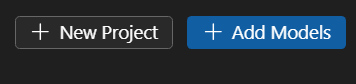

# Manage Model Lab Project
## Open Project
Open model project folder through Vscode. Click File -> Open Folder, select model project folder. You need to close folder first if you already open one.

If you don't want to open a existing model project, you can [create a new model project](../QuickStart.md#create-project).

## Add Model
1. Open a model project. Click `Workflow`. On right top of the page, Click `Add models`.

2. Select a base model you want to operate on. Click `Add`.
3. A folder contains new model files will be created on current project folder.

## Create A New Project
Click `Workflow`. On right top of the page, Click `New Project`.

Alternatively, you can close model project and [create project](#create-project) from beginning.
