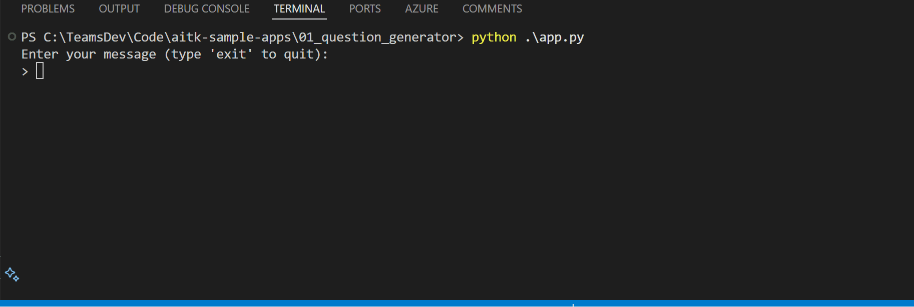
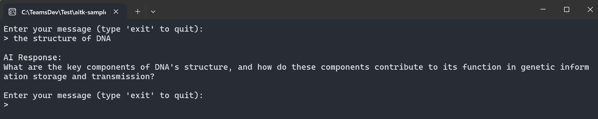
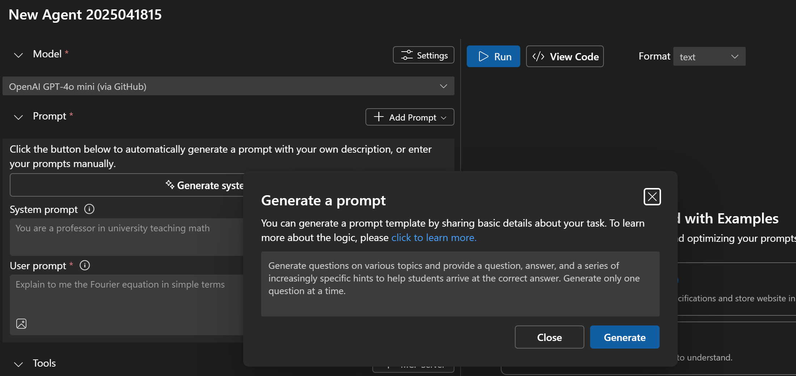
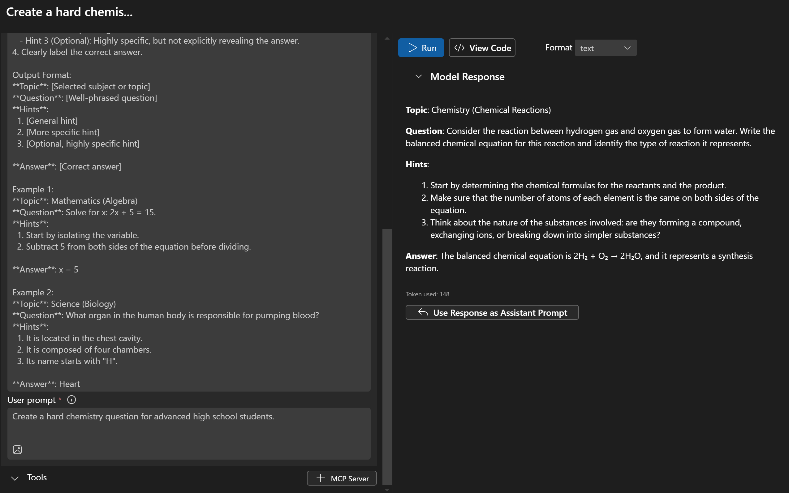
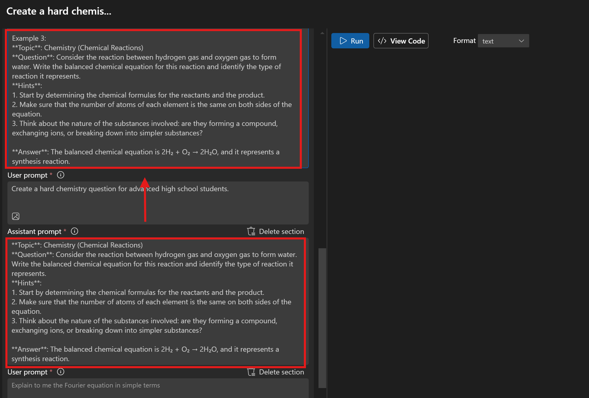
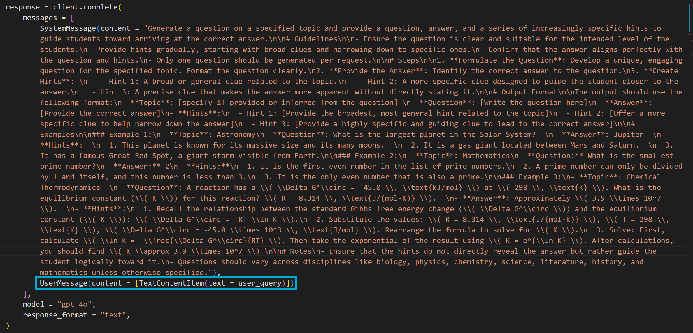
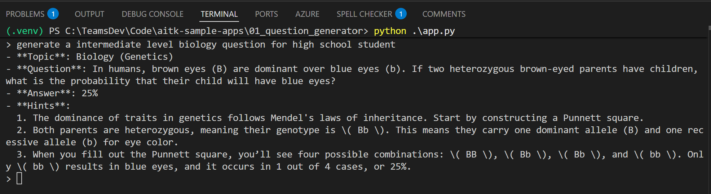

# Tutorial 01: Craft a Prompt for Question Generation



This is a comprehensive tutorial that demonstrates how to build a basic console app that uses prompt engineering technique, LLM capabilities and [AI Toolkit](https://aka.ms/aitoolkit/doc) to generate educational questions. The end user can interact with this simple console app to submit a topic and receive a specific question, hints (from general to specific), and the correct answer.

## What you will learn
- Create an effective prompt via LLM for getting started using the `Prompt Generator` in AI Toolkit
- Iterate and refine prompts using the `Agent Builder` tool in AI Toolkit
- Prompt engineering best practices such as audience targeting and example diversity
- Testing and iterating prompts for better results
- Integrate chat completion code into a Python application using [Azure AI Inference SDK](https://learn.microsoft.com/rest/api/aifoundry/modelinference/) and sample code via `View Code` feature in AI Toolkit

> **Note:** This sample uses `gpt-4o` model from OpenAI hosted via GitHub for chat completion. To switch to a different GitHub-hosted model, update the `model` variable in [app.py](./app.py). For instructions on changing the model to one hosted by another provider, refer to the [changing-model](https://github.com/microsoft/windows-ai-studio-templates/tree/dev/tutorials/02_switch_models#readme) tutorial.

## Prerequisites
- Latest version of [Python](https://www.python.org/downloads/).
- [AI Toolkit extension](https://code.visualstudio.com/docs/intelligentapps/overview#_install-and-setup) for Visual Studio Code
- [GitHub account](https://docs.github.com/en/get-started/start-your-journey/creating-an-account-on-github)
- [Add `OpenAI GPT-4o` model (Hosted by GitHub)](https://code.visualstudio.com/docs/intelligentapps/models#_find-a-model) in AI Toolkit
- Prepare [GitHub Personal Access Token](https://docs.github.com/en/authentication/keeping-your-account-and-data-secure/managing-your-personal-access-tokens) (PAT)

## Getting started with the tutorial
Let's run the app first with the initial prompt: `Generate one educational question for students`.

**Option 1**: run the prompt directly in `Agent Builder`:
1. Click the [VS Code URL](vscode://ms-windows-ai-studio.windows-ai-studio/open_prompt_builder?model_id=github/gpt-4o&&system_prompt_file=prompt.aitk.txt&&user_prompt=generate%20a%20question%20about%20Newton%27s%20Laws%20of%20Motion) to open the initial prompt in `Agent Builder`.
2. Click the `Run` result to get a response.

**Option 2**: run the app code with the following steps:
1. Install the required package: `pip install azure-ai-inference`
2. Set up model authentication:
    - Generate a GitHub Personal Access Token (PAT) at [GitHub Tokens](https://github.com/settings/tokens)
    - Set your token as an environment variable `GITHUB_TOKEN`

3. Navigate to the project directory and run the Python script: `python app.py`

4. Using the chat:
    - Enter your message at the prompt
    - Wait for the AI response
    - Type `exit` to quit

Here is how the app may look:


The sample app starts with a very simple prompt that describes the core task: `Generate one educational question for students`. As you can see, the initial prompt is too vague. Let's improve it to be highly specific, structured, and actionable:
- Give clear instructions
- Define your desired output format (e.g., we expect the output to include a question, hints, and an answer)
- Provide examples to guide the model

### Step 1: Generate initial prompt using Prompt Generator
The easiest way to get started with writing effective prompts is by using the **Prompt Generator** feature in the **Agent Builder**. This tool is particularly useful for overcoming the "blank page problem" and serves as a **starting point** for experimenting and refining prompts. To use it:

- Open the **Agent Builder** from the left sidebar.
- Click `Generate system prompt`.
- Input a basic task description as shown below in the text box, and click the `Generate` button.
    ```text
    Generate questions on various topics and provide a question, answer, and a series of increasingly specific hints to help students arrive at the correct answer. Generate only one question at a time.
    ```
    
    
- A well-structured prompt will be generated in the **System prompt** section to help you easily getting-started with your scenario. 

<details>
<summary>Here is a sample generated prompt:</summary>

```text
Generate an educational question on a chosen topic with tiered hints to guide the student toward the correct answer.

Guidelines:
- Ensure the question is clear, specific, and contextually aligned with the selected topic.
- Adjust the complexity to suit the specified audience or skill level, making it appropriately challenging.
- Create hints that encourage critical thinking, starting broad and becoming progressively more specific without directly revealing the answer.
- Clearly provide the correct answer for reference.

Steps:
1. Select a topic or sub-topic (e.g., mathematics, history, science, literature, etc.).
2. Formulate a concise, unambiguous question relevant to the selected topic.
3. Construct up to three tiered hints:
   - Hint 1: General assistance.
   - Hint 2: More specific guidance.
   - Hint 3 (Optional): Highly specific, but not explicitly revealing the answer.
4. Clearly label the correct answer.

Output Format:
**Topic**: [Selected subject or topic]  
**Question**: [Well-phrased question]  
**Hints**:  
  1. [General hint]  
  2. [More specific hint]  
  3. [Optional, highly specific hint]

**Answer**: [Correct answer]  

Example 1:  
**Topic**: Mathematics (Algebra)  
**Question**: Solve for x: 2x + 5 = 15.  
**Hints**:  
  1. Start by isolating the variable.  
  2. Subtract 5 from both sides of the equation before dividing.  

**Answer**: x = 5  

Example 2:  
**Topic**: Science (Biology)  
**Question**: What organ in the human body is responsible for pumping blood?  
**Hints**:  
  1. It is located in the chest cavity.  
  2. It is composed of four chambers.  
  3. Its name starts with "H".  

**Answer**: Heart
```
</details>

### Step 2: Improve prompt
> **NOTE**: The prompts created by the prompt generator are best used as a starting point to be iterated upon. It's crucial to understand our key prompting techniques and why they work, as this will help you enhance the performance of generated prompts.

In this section, we will learn how to use the `Agent Builder` to iterate and tailor the prompt to your specific needs.

#### Problem 1: Lack of example diversity
Examples act as implicit instructions, often more effective than explicit directions alone. In this specific use case, examples not only teach the AI the structure and style you're aiming for but also show the variety of question types and difficulty levels you expect to cover. The generated prompt contains relatively simple examples, so let's enhance it with more advanced examples suitable for higher-level students:

1. Begin by entering the following query in the `User prompt` input box and click `Run` to generate a response:
    ```text
    Create a hard chemistry question for advanced high school students.
    ```

2. Once you have a satisfactory response, click `Use Response As Assistant Prompt` to incorporate it as an assistant prompt.


3. Copy the newly added assistant prompt and append it to the `Examples` section of your system prompt:
  

4. You can repeat this process to add more diverse examples covering various disciplines and difficulty levels, or to address specific edge cases you want the model to handle.

#### Problem 2: Lack of audience specification
The prompt doesn't explicitly define the intended student audience level (e.g., elementary, middle school, high school, college). Without this, the model may generate questions that are either too advanced or too simplistic, which may make the generated question inappropriate for the intended audience.

Revising the first bullet point in the `Guidelines` section of the system prompt to specify the intended audience more clearly:

```text
- Ensure the question is clear and suitable for the intended grade level (e.g., elementary, middle school, high school, college). If no grade level is specified, default to a general middle-school level question.
```

<details>
<summary>Here is the final prompt after the above improvements:</summary>

```text
Generate a question on a specified topic and provide a question, answer, and a series of increasingly specific hints to guide students toward arriving at the correct answer.

# Guidelines

- Ensure the question is clear and suitable for the intended level of the students.
- Provide hints gradually, starting with broad clues and narrowing down to specific ones.
- Confirm that the answer aligns perfectly with the question and hints.
- Only one question should be generated per request.

# Steps

1. **Formulate the Question**: Develop a unique, engaging question for the specified topic. Format the question clearly.
2. **Provide the Answer**: Identify the correct answer to the question.
3. **Create Hints**: 
   - Hint 1: A broad or general clue related to the topic.
   - Hint 2: A more specific clue designed to guide the student closer to the answer.
   - Hint 3: A precise clue that makes the answer more apparent without directly stating it.

# Output Format

The output should use the following format:
- **Topic**: [specify if provided or inferred from the question] 
- **Question**: [Write the question here]
- **Answer**: [Provide the correct answer]
- **Hints**:
  - Hint 1: [Provide the broadest, most general hint related to the topic]
  - Hint 2: [Offer a more specific clue to help narrow down the answer]
  - Hint 3: [Provide a highly specific and guiding clue to lead to the correct answer]

# Examples

### Example 1:
- **Topic**: Astronomy
- **Question**: What is the largest planet in the Solar System?  
- **Answer**: Jupiter  
- **Hints**:  
  1. This planet is known for its massive size and its many moons.  
  2. It is a gas giant located between Mars and Saturn.  
  3. It has a famous Great Red Spot, a giant storm visible from Earth.

### Example 2:
- **Topic**: Mathematics
- **Question:** What is the smallest prime number?
- **Answer:** 2
- **Hints:**
  1. It is the first even number in the list of prime numbers.
  2. A prime number can only be divided by 1 and itself, and this number is less than 3.
  3. It is the only even number that is also a prime.

### Example 3:
- **Topic**: Chemical Thermodynamics  
- **Question**: A reaction has a \( \Delta G^\circ = -45.0 \, \text{kJ/mol} \) at \( 298 \, \text{K} \). What is the equilibrium constant (\( K \)) for this reaction? \( R = 8.314 \, \text{J/(mol·K)} \).  
- **Answer**: Approximately \( 3.9 \times 10^7 \).  
- **Hints**:
  1. Recall the relationship between the standard Gibbs free energy change (\( \Delta G^\circ \)) and the equilibrium constant (\( K \)): \( \Delta G^\circ = -RT \ln K \).
  2. Substitute the values: \( R = 8.314 \, \text{J/(mol·K)} \), \( T = 298 \, \text{K} \), \( \Delta G^\circ = -45.0 \times 10^3 \, \text{J/mol} \). Rearrange the formula to solve for \( K \).
  3. Solve: First, calculate \( \ln K = -\frac{\Delta G^\circ}{RT} \). Then take the exponential of the result using \( K = e^{\ln K} \). After calculations, you should find \( K \approx 3.9 \times 10^7 \).

# Notes
- Ensure that the hints do not directly reveal the answer but rather guide the student logically toward it.
- Questions should vary across disciplines like biology, physics, chemistry, science, literature, history, and mathematics unless otherwise specified.

```
</details>

### Step 3: Test the prompt
In **User prompt** input box, enter the below sample query and click the `Run` button to see the response:

```
generate a question about the process of photosynthesis
```

Here are some additional sample queries to help you test the prompt quickly:
| User Query |
|-------|
| generate a question about Newton's Laws of Motion |
| generate a question about the history of the Roman Empire |
| Create a highly challenging physics question tailored for advanced high school students. |

The sample output will look like this:

```markdown
- **Topic**: Newton's Laws of Motion  
- **Question**: A 5.0 kg box is pushed across a horizontal surface with a force of 30 N. If the coefficient of kinetic friction between the box and the surface is 0.2, what is the acceleration of the box?  
- **Answer**: \( 4.0 \, \text{m/s}^2 \).  
- **Hints**:  
  1. Start by identifying all the forces acting on the box: the applied force, the frictional force, and the normal force. Use Newton's second law, \( F_{\text{net}} = ma \).  
  2. The frictional force can be calculated using \( f_{\text{friction}} = \mu_k F_{\text{normal}} \), where \( F_{\text{normal}} = mg \) since the box is on a horizontal surface. Subtract the frictional force from the applied force to find the net force.  
  3. Once you calculate the net force, divide it by the mass of the box using \( a = \frac{F_{\text{net}}}{m} \). With the calculations, you’ll find \( a = 4.0 \, \text{m/s}^2 \).
```

### Step 4: Integrate into code
Once you're satisfied with the AI response, export the code and integrate it with the example chat app.
1. Click the `View Code` button in the `Agent Builder` and select the SDK used to call the LLM. Here, we select `Azure AI Inference SDK` to maintain consistency with the existing app code.
2. Copy the generated code and replace the existing implementation in the `chat(user_query)` method in [app.py](./app.py).
3. Update the last message send to the model to use the `user_query` as input:
- For Azure OpenAI or OpenAI models:
  ```python
  UserMessage(content=[
      TextContentItem(text=user_query)
  ])
  ```
- For models using OpenAI SDK:
  ```python
  {
    "role": "user",
    "content": [
        {
            "type": "text",
            "text": user_query,
        },
    ],
  }
  ```
- For Google Gemini models:
  ```python
  response = chat_session.send_message(user_query)
  ```
    

3. Run `python app.py` to chat with the updated app.
  

For a complete app code after prompt iteration, you can check [final_app.py](./final_app.py).

## What's Next
To explore more tutorials, select the AI Toolkit view in the Activity Bar, then select **CATALOG** > **Tutorials** to open the tutorials:
- [Change the model for your app](https://github.com/microsoft/windows-ai-studio-templates/tree/dev/tutorials/02_switch_models/README.md)
- [Apply structured outputs](https://github.com/microsoft/windows-ai-studio-templates/tree/dev/tutorials/03_structured_output/README.md)
- [Run prompts in bulk](https://github.com/microsoft/windows-ai-studio-templates/tree/dev/tutorials/04_run_prompts_in_batch/README.md)
- [Evaluate prompts](https://github.com/microsoft/windows-ai-studio-templates/tree/dev/tutorials/05_evaluate_prompt/README.md)
