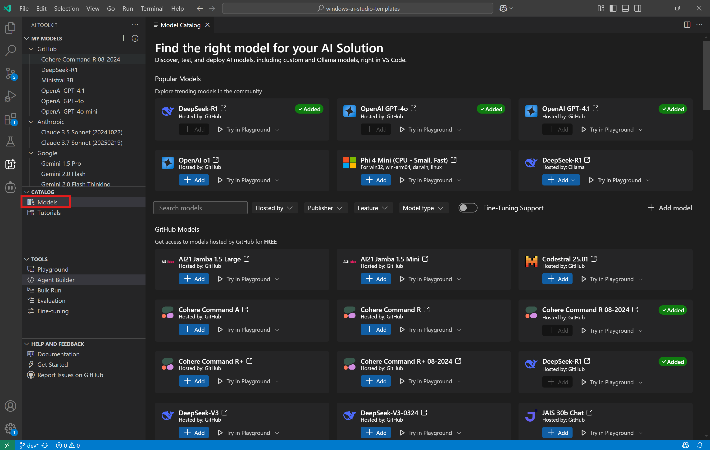
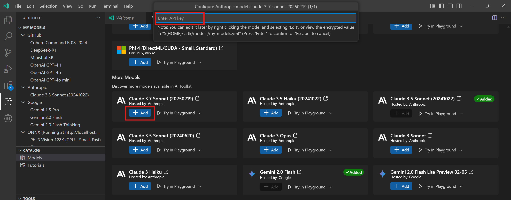
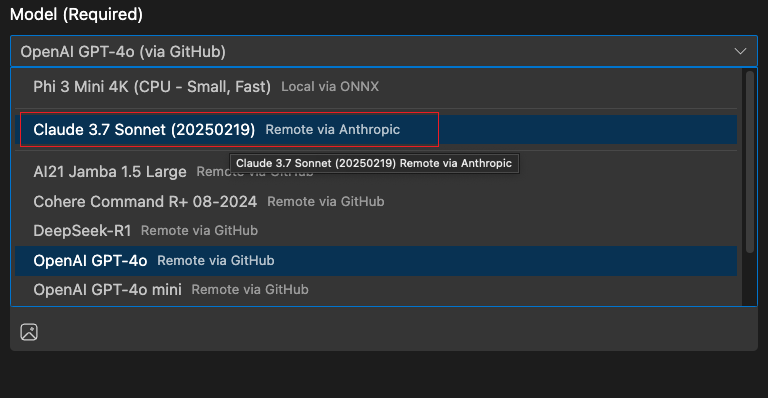
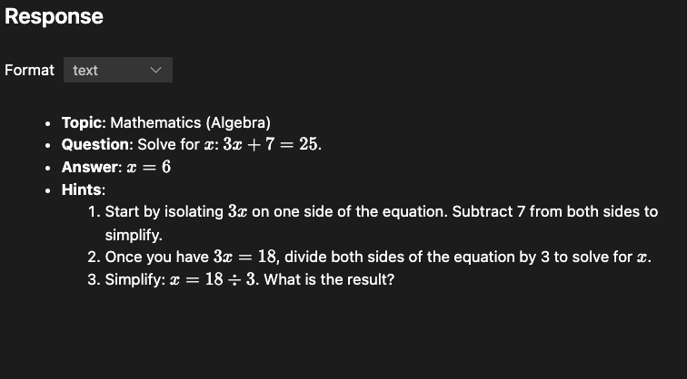
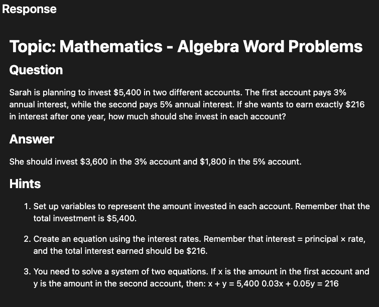
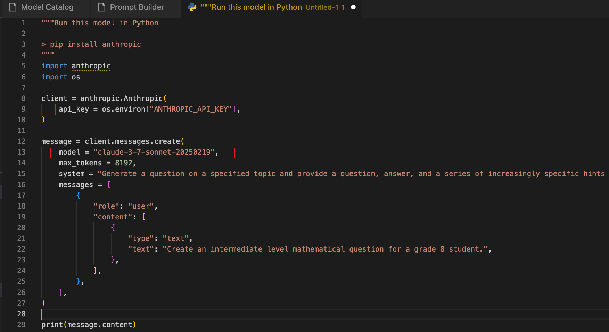

# Tutorial 02: Switch to a different model

This tutorial builds on top of the [Craft Prompt](../01_craft_prompt/tutorial_01.md) tutorial that showcases how to how to switch to a different model in the AI Toolkit. The AI Toolkit provides a variety of models to choose from, allowing you to select the one that best fits your needs. This is particularly useful when you want to experiment with different models or when you need to switch to a different model provider for any reason.

> **Note:** AI Toolkit supports [multiple model providers](https://code.visualstudio.com/docs/intelligentapps/models#_find-a-model) including models hosted by GitHub and Publisher (OpenAI, Anthropic and Google etc) as well as using models running locally via ONNX or Ollama runtime. And you can even [bring your own models](https://code.visualstudio.com/docs/intelligentapps/models#_bring-your-own-models).

## What you will learn
- Experiment with different models in `Prompt Builder`
- `View Code` and update the app for the selected model

## Prerequisites
- Completed the [Craft Prompt](../01_craft_prompt/tutorial_01.md) tutorial
- Latest version of [Python](https://www.python.org/downloads/)
- [AI Toolkit extension](https://code.visualstudio.com/docs/intelligentapps/overview#_install-and-setup) for Visual Studio Code
- Anthropic API key (Or access to desired model providers such as Goggle)

## Experiment with different models in Prompt Builder

### Step 1: Add a new model
1. Open Model Catalog in the AI Toolkit sidebar
2. Search for Claude in the catalog

3. Click `Add` in the Claude 3.7 Sonnet model card
4. Enter the Cluade API Key

You can refer to [this document](https://code.visualstudio.com/docs/intelligentapps/models) for more instructions on adding a model, such as using Ollama models.

### Step 2: elect and Test the Model in Prompt Builder
1. Open the **Prompt Builder** in the AI Toolkit sidebar
2. Select the Claude 3.7 model (Or the model you added)

3. Copy the system prompt from [final_prompt.txt](./final_prompt.txt) we built from previous tutorial and input it.
4. Enter a user prompt to test the new model, for example: `Create an intermediate level mathematical question for a grade 8 student.`
5. Verify if the response works as expected.

### Step 3: Compare results
Now that you can run the same prompt against different models, you can compare them to find the one that best works for you:

| OpenAI GPT-4o | Anthropic Claude 3.7 Sonnet |
|----------|----------|
|     |    |

### Step 4: Export code
Once you are satisfied with the response and decide to switch to Claude 3.7 model, you can export the code and update it in the console app we previously built.
1. Click `View Code` to open the code sample in VS Code editor.
2. Copy the code sample to the `chat` API in [final_app.py](./final_app.py).
3. Depending on your chosen model, install requirement Python package(s) and set the API key if needed.

