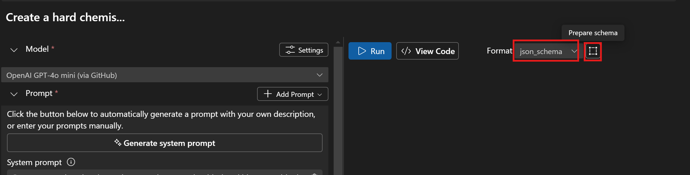
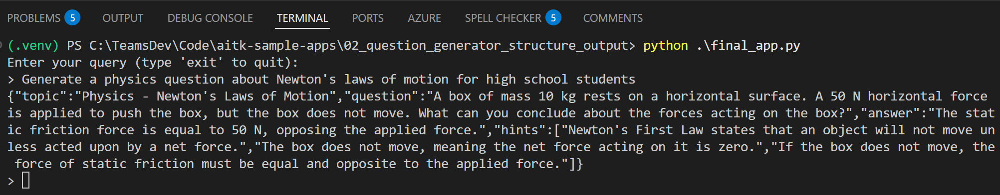

# Tutorial 03: Apply Structured Outputs using JSON Schema

When building AI applications, getting consistent and machine-readable responses is crucial. Using unstructured text responses has many drawbacks:
- Requires complex parsing logic
- Can vary in format between responses
- May include unwanted information
- Are difficult to validate

Structured outputs ensure the model will always generate responses that adhere to your supplied [JSON Schema](https://json-schema.org/overview/what-is-jsonschema). Modern AI models like GPT-4o and Gemini support JSON mode, allowing you to define the exact structure you want.

## What you will learn
- Apply **Structured Outputs** for the prompts in `Prompt Builder`
- Update the console app code to use the schema for the output

## Prerequisites
- Completed the [Craft Prompt](https://github.com/microsoft/windows-ai-studio-templates/tree/dev/tutorials/01_craft_prompt/README.md) tutorial
- Latest version of [Python](https://www.python.org/downloads/)
- [AI Toolkit extension](https://code.visualstudio.com/docs/intelligentapps/overview#_install-and-setup) for Visual Studio Code
- Access to desired model providers

## Getting started with the tutorial
Remember the [Craft Prompt](https://github.com/microsoft/windows-ai-studio-templates/tree/dev/tutorials/01_craft_prompt/README.md) tutorial we went through earlier? In that tutorial, we built a prompt to generate questions for educational scenarios with samples and instructions to guide the AI to use markdown output in this format:

- **Topic**: Mathematics
- **Question:** What is the smallest prime number?
- **Answer:** 2
- **Hints:**
    1. It is the first even number in the list of prime numbers.
    2. A prime number can only be divided by 1 and itself, and this number is less than 3.
    3. It is the only even number that is also a prime.

You can quickly load the model and prompt in `Prompt Builder` for a quick test on the app by clicking this [VS Code URL](vscode://ms-windows-ai-studio.windows-ai-studio/open_prompt_builder?model_id=github/gpt-4o&&system_prompt_file=prompt.aitk.txt&&user_prompt=generate%20a%20question%20about%20Newton%27s%20Laws%20of%20Motion)

Now, let's improve this by implementing structured outputs using JSON schema, which will make the responses more consistent and easier to process programmatically.

### Step 1: Define the schema
First, create a schema file that describes the exact response format for the generated educational questions:

> **NOTE**: JSON schema formats may differ slightly between different model providers.

<details>
<summary>Example schema used with Open AI models</summary>
  ```json
  {
    "name": "Question_Generator",
    "strict": true,
    "schema": {
      "type": "object",
      "description": "Schema for educational questions with hints and answers",
      "properties": {
        "topic": {
          "type": "string",
          "description": "The academic subject of the question"
        },
        "question": {
          "type": "string",
          "description": "The educational question to be answered"
        },
        "answer": {
          "type": "string",
          "description": "The correct answer to the question"
        },
        "hints": {
          "type": "array",
          "description": "List of progressive hints to help solve the question",
          "items": {
            "type": "string"
          }
        }
      },
      "required": [
        "topic",
        "answer",
        "question",
        "hints"
      ],
      "additionalProperties": false
    }
  }
  ```
</details>

<details>
<summary>Example schema used with Google Gemini models</summary>
  ```json
  {
      "type": "object",
      "description": "Schema for educational questions with hints and answers",
      "properties": {
          "topic": {
              "type": "string",
              "description": "The academic subject of the question"
          },
          "question": {
              "type": "string",
              "description": "The educational question to be answered"
          },
          "hints": {
              "type": "array",
              "description": "List of progressive hints to help solve the question",
              "items": {
                  "type": "string"
              }
          },
          "answer": {
              "type": "string",
              "description": "The correct answer to the question"
          }
      },
      "required": [
          "topic",
          "question",
          "answer",
          "hints"
      ]
  }
  ```
</details>

### Step 2: Update prompt
Modify the existing system prompt to maintain consistency with structured output:
- Remove the `# Output Format` section since we're specifying a JSON schema when calling the chat completion API
- Update the examples to JSON format

  ```text
  # Examples
  ### Example 1: Topic - Astronomy
  {
    "topic": "Astronomy",
    "question": "What is the largest planet in the Solar System?",
    "answer": "Jupiter",
    "hints": [
      "This planet is known for its massive size and its many moons.",
      "It is a gas giant located between Mars and Saturn.",
      "It has a famous Great Red Spot, a giant storm visible from Earth."
    ]
  }

  ### Example 2: Topic - Mathematics
  {
    "topic": "Mathematics",
    "question": "What is the smallest prime number?",
    "answer": "2",
    "hints": [
      "It is the first even number in the list of prime numbers.",
      "A prime number can only be divided by 1 and itself, and this number is less than 3.",
      "It is the only even number that is also a prime."
    ]
  }

  ### Example 3: Topic - Chemical Thermodynamics
  {
    "topic": "Chemical Thermodynamics",
    "question": "A reaction has a ΔG° = -45.0 kJ/mol at 298 K. What is the equilibrium constant (K) for this reaction? R = 8.314 J/(mol·K).",
    "answer": "Approximately 3.9 × 10^7",
    "hints": [
      "Recall the relationship between the standard Gibbs free energy change (ΔG°) and the equilibrium constant (K): ΔG° = -RT ln K.",
      "Substitute the values: R = 8.314 J/(mol·K), T = 298 K, ΔG° = -45.0 × 10^3 J/mol. Rearrange the formula to solve for K.",
      "Solve: First, calculate ln K = -ΔG°/(RT). Then take the exponential of the result using K = e^ln K. After calculations, you should find K ≈ 3.9 × 10^7."
    ]
  }
  ```

Here is the final prompt: [final_prompt.aitk.txt](./final_prompt.aitk.txt)

### Step 3: Test the prompt

To test whether your prompt works correctly with the JSON schema, open [this VS Code URL](vscode://ms-windows-ai-studio.windows-ai-studio/open_prompt_builder?model_id=github/gpt-4o&&system_prompt_file=prompt.aitk.txt&&user_prompt=generate%20a%20question%20about%20Newton%27s%20Laws%20of%20Motion&&response_format_type=json_schema&&response_format_json_file=response_schema_openai.json) to launch the prompt builder with everything configured correctly.

Then you can start from step 5 below to test the prompt:
1. Open the **Prompt Builder** in the AI Toolkit sidebar.
2. Enter your system prompt from [final_prompt.aitk.txt](./final_prompt.aitk.txt).
3. Configure the response format:
  - Click on the **Response Format** dropdown and select `json_schema`.
  
  - Click the **Prepare schema** button.
  - Choose **Use local file** and select either [response_schema_openai.json](./response_schema_openai.json) (for OpenAI models) or [response_schema_gemini.json](response_schema_gemini.json) (for Gemini models) based on which model you're using.
4. Enter a test query in the **User prompt** field, such as:
   ```text
   Generate a physics question about Newton's laws of motion for high school students
   ```

5. Click **Run** to see the response.

6. Verify that:
    - The response is properly formatted as JSON
    - All required fields are present (topic, question, hints, answer)
    - The JSON is valid and matches the schema structure, below is an example response:

    ```json
    {
      "topic": "Physics - Newton's Laws of Motion",
      "question": "A 5 kg box is pushed across a frictionless surface with a constant force of 20 N. What is the acceleration of the box?",
      "answer": "4 m/s²",
      "hints": [
        "Remember Newton's second law of motion states that force is equal to mass times acceleration (F = ma).",
        "You have the mass of the box and the total force applied to it, so you can rearrange the equation to solve for acceleration (a = F/m).",
        "To find the acceleration, divide the force of 20 N by the mass of the box which is 5 kg."
      ]
    }
    ```

### Step 4: Update app code
Now that you've validated your schema works correctly, let's integrate structured outputs into the application code:

1. In the `Prompt Builder`, click the `View Code` button to generate a code sample in VS Code.
2. Copy the generated code and replace the existing implementation in the `chat(user_query)` method in [app.py](./app.py).
3. Ensure the last user message sent to the model uses the `user_query` variable as input:
  - For Azure OpenAI or OpenAI models:
    ```python
    UserMessage(content=[
        TextContentItem(text=user_query)
    ])
    ```
  - For models using OpenAI SDK:
    ```python
    {
      "role": "user",
      "content": [
          {
              "type": "text",
              "text": user_query,
          },
      ],
    }
    ```
  - For Google Gemini models:
    ```python
    response = chat_session.send_message(user_query)
    ```

4. Run `python app.py` to chat with the updated app.
  

  For a complete implementation with structured output, see [final_app.py](./final_app.py) which demonstrates using GitHub's gpt-4o model with the Azure AI Inference SDK.

## What's Next
To explore more tutorials, select the AI Toolkit view in the Activity Bar, then select **CATALOG** > **Tutorials** to open the tutorials recommended below:

- [Bulk run prompts](https://github.com/microsoft/windows-ai-studio-templates/tree/dev/tutorials/04_run_prompts_in_batch/README.md)
- [Run evaluation](https://github.com/microsoft/windows-ai-studio-templates/tree/dev/tutorials/05_evaluate_prompt/README.md)