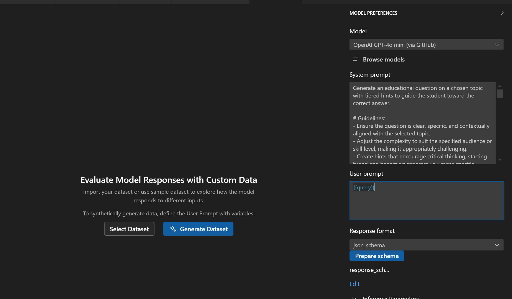
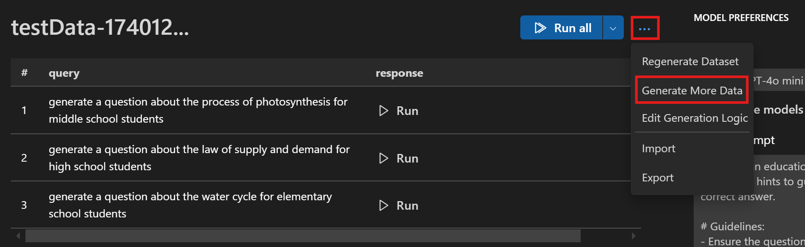
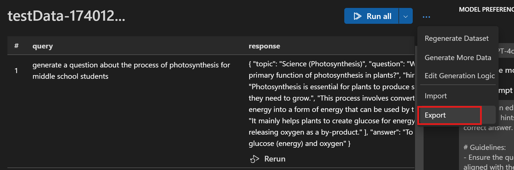

# Tutorial 04: Bulk Run Prompts against LLM Generated Dataset

After completing previous tutorials, you might wonder: now that I know this console app can generate one question at a time, how can I generate multiple questions? Can my prompt accept a variable? How can I test multiple scenarios to see the LLM's effectiveness without manually entering topics one by one?

Let's dive into using variables in prompts and executing them in bulk.

## What you will learn
- Use variables in prompts via the `Bulk Run` feature in AI Toolkit
- Use LLM capability to automatically generate topics for educational questions
- Perform bulk runs on datasets
- Export data (input & output) for further evaluation

## Prerequisites
- Completed the [Craft Prompt](https://github.com/microsoft/windows-ai-studio-templates/tree/dev/tutorials/01_craft_prompt/README.md) tutorial
- Latest version of [Python](https://www.python.org/downloads/)
- [AI Toolkit extension](https://code.visualstudio.com/docs/intelligentapps/overview#_install-and-setup) for Visual Studio Code
- Access to desired model providers

## Getting started with the tutorial
### Step 1: Add prompts with variables to `Bulk Run`
First, let's go to `Bulk Run` in AI Toolkit to input our previously built prompts and add variables in the user prompt so we can provide various topics.

1. In the AI Toolkit view, select **TOOLS** > **Bulk Run** to open the Bulk Run view.
2. Copy and paste the system prompt from `prompt.aitk.txt`
3. Input `{{query}}` in the user prompt input box. This indicates that the user prompt will accept a series value defined via the variable `query`
4. In `Response Format`, select `json_schema`, then click the `Prepare schema` button, select `Use local file`, and choose the `response_schema.json` file as the JSON schema file

### Step 2: Generate synthetic data
We can leverage the power of LLM to come up with a list of topics, which will be referred to as a dataset or test cases to use as the user prompt. LLM will automatically detect the prompt we entered and generate a relevant dataset (test cases). 

Follow these steps:
1. Click `Generate Dataset` to generate the initial dataset.

2. You can also click the `Generate More Data` button to add more test data.

### Step 3: Bulk Run
1. Click the `Run all` button to get responses for the entire input dataset.
2. Click the `...` icon and select `Export` to save the results to a JSONL file. This file will then be used to perform evaluation.

## What's Next
To explore more tutorials, select the AI Toolkit view in the Activity Bar, then select **CATALOG** > **Tutorials** to open the tutorials recommended below:

- [Run evaluation](https://github.com/microsoft/windows-ai-studio-templates/tree/dev/tutorials/05_evaluate_prompt/README.md)