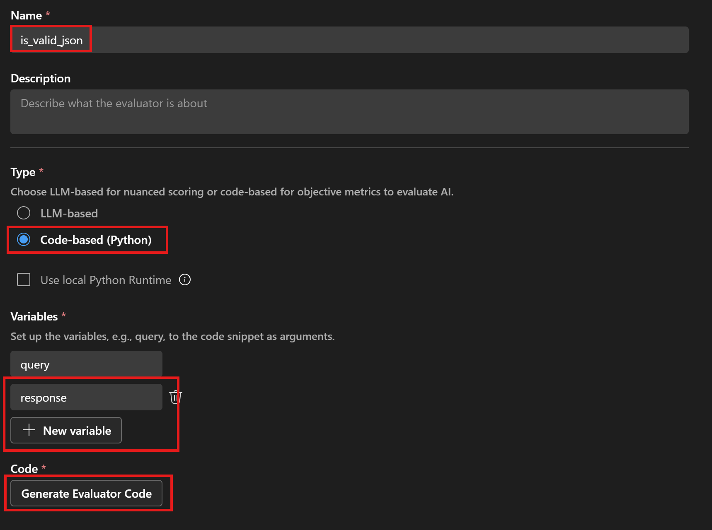

# Bulk Run Prompts against a Dataset

After completing previous tutorials, you will probably have this question: now that I know this console app can generate one question at a time, but I need to generate multiple questions. Can my prompt accept an variable? How can I test mutiple scenairos to see the LLM's effectiveness without manually entering topics one by one?

Let's dive into using variables in prompts and execute them in batch at once.

## What you will learn

- Use variables in prompt via `Bulk Run` feature in AI Toolkit
- Use LLM capability to automatically generate topics for educational questions
- Perform bulk runs on datasets
- Export data (input & output) for further evaluation
<!-- - Create and run evaluations
- Add a code-based (Python) evaluator -->

## Prerequisites

- Completed the [Craft Prompt](../01_craft_prompt/README.md) tutorial
- Latest version of [Python](https://www.python.org/downloads/)
- [AI Toolkit extension](https://code.visualstudio.com/docs/intelligentapps/overview#_install-and-setup) for Visual Studio Code
- Access to desired model providers

## Add prompts with variable to `Bulk Run`
First, let's go to `Bulk Run` in AI Toolkit to input our previously built prompts and add variables in the user prompt so we can provide various topics.

Follow these steps:
1. In the AI Toolkit view, select **TOOLS** > **Bulk Run** to open the Bulk Run view.
2. Copy and paste the system prompt from `prompt.txt`
3. Input `{{query}}` in the user prompt input box. This indicates that user prompt will accpet a series value deinfed via the variable `query`
4. In `Response Format`, select `json_schema`, then click the `Prepare schema` button, select `Use local file`, and choose the `response_schema.json` file as the JSON schema file

## Generate synthetic data
We can leverage the power of LLM to come up with a list of topics, which will be refered as dataset or test cases to use as the user prompt. LLM will automatically detect the prompt we entered and generate relevant dataset (test cases). 

Follow these steps:
1. Click `Generate Dataset` to generate the initial dataset.

4. You can also click the `Generate More Data` button to add more test data.

## Bulk Run
1. Click the `Run all` button to get responses for the entire input dataset.
2. Click the `...` icon and select `Export` to save the results to a JSONL file. This file will then be used to perform evaluation.

## Add a Code-based Evaluator

Evaluation criteria we want to add for this user scenario:
- **is_valid_json** (code-based evaluator): Ensure that the output generated by the AI model adheres to the expected JSON schema. This includes checking for the presence of required fields and the correct data types.
- **Relevance** (built-in LLM-as-a-judge evaluator): Assess the relevance of the generated questions to the provided topic. This involves evaluating whether the questions are meaningful and appropriate for the given subject area.

To add a code-based evaluator, follow these steps:
1. In the AI Toolkit view, select **TOOLS** > **Evaluation**.
2. Click the `Evaluators` tab, then click `Create Evaluator`.
3. Configure the `is_valid_json` evaluator as shown below:

4. Click `Generate Evaluator Code` to open the evaluator code file in VS Code. Copy the code sample from [is_valid_json_evaluator.py](./is_valid_json_evaluator.py) and save the code.

## Create and Run Evaluation

1. In the **Evaluation** overview page:
2. Select `Create Evaluation`, and then provide the following information:
    - Evaluation job name: default or a name you specify
    - Evaluator: select the `is_valid_json` and `Relevance` evaluator.
    - Judging model: a model from the list that can be selected as judging model to evaluate for some evaluators.
    - Dataset: select the JSON file you exported from the previors bulk runs
3. A new evaluation job is created and you will be prompted to open your new evaluation job details.
4. Verify your dataset and select `Run Evaluation` to start the evaluation.
5. Once the evaliation job completed, you can check the result in the `Evaluation` view:

