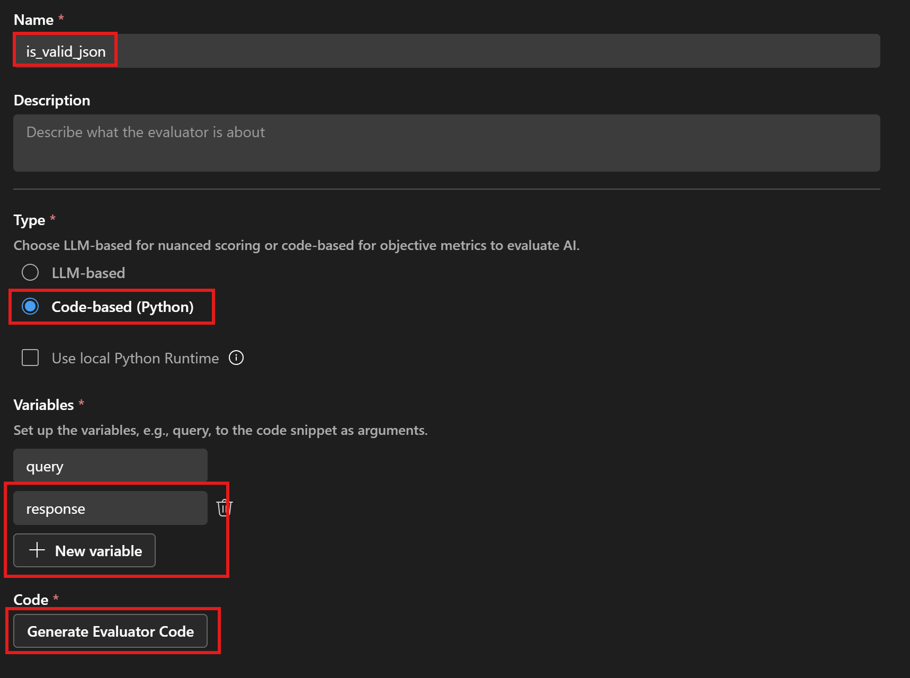
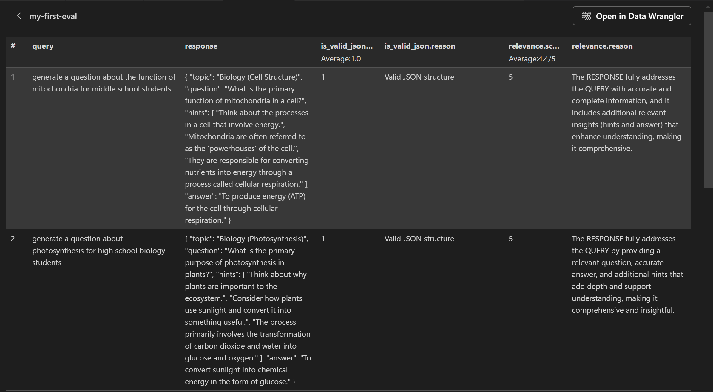

# Tutorial 05: Evaluate Prompts with Built in and Custom Evaluator

This tutorial will walk you through the process of creating and running evaluations for your prompts using the AI Toolkit extension for Visual Studio Code. Evaluations are crucial for assessing the quality and effectiveness of your prompts. In this tutorial, you will learn how to add a code-based evaluator and create and run evaluations.

## Prerequisites
- Completed the [Batch Run Prompt](../04_run_prompts_in_batch/README.md) tutorial
- Latest version of [Python](https://www.python.org/downloads/)
- [AI Toolkit extension](https://code.visualstudio.com/docs/intelligentapps/overview#_install-and-setup) for Visual Studio Code
- Access to desired model providers

## What you will learn
- Create and run built-in evaluators and `Evaluation` feature in AI Toolkit
- Create a code-based evaluator in Python and use in AI Toolkit

## Getting started with the tutorial
we will consider two criteria to evaluate the effectiveness of our prompt use in the educational question generator app:
- **is_valid_json** (code-based evaluator): Ensure that the output generated by the AI model adheres to the expected JSON schema. This includes checking for the presence of required fields and the correct data types.
- **Relevance** (built-in LLM-as-a-judge evaluator): Assess the relevance of the generated questions to the provided topic. This involves evaluating whether the questions are meaningful and appropriate for the given subject area.

### Step 1: add a code-based evaluator
1. In the AI Toolkit view, select **TOOLS** > **Evaluation**.
2. Click the `Evaluators` tab, then click `Create Evaluator`.
3. Configure the `is_valid_json` evaluator as shown below:

1. Click `Generate Evaluator Code` to open the evaluator code file in VS Code. Copy the code sample from [is_valid_json_evaluator.py](./is_valid_json_evaluator.py) and save the code.

### Step 2: Create and run Evaluation
1. In the **Evaluation** overview page:
2. Select `Create Evaluation`, and then provide the following information:
    - Evaluation job name: default or a name you specify
    - Evaluator: select the `is_valid_json` and `Relevance` evaluator.
    - Judging model: a model from the list that can be selected as judging model to evaluate for some evaluators.
    - Dataset: select the JSON file you exported from the previous bulk runs
3. A new evaluation job is created and you will be prompted to open your new evaluation job details.
4. Verify your dataset and select `Run Evaluation` to start the evaluation.
5. Once the evaluation job completed, you can check the result in the `Evaluation` view:
